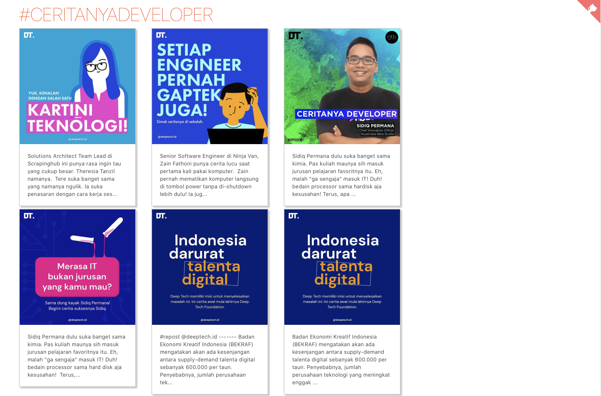

# Sveltagram

Demo membangun aplikasi dengan Svelte untuk menampikan data dan gambar dari Instagram. Tutorial lengkapnya dapat ditemukan di https://rizafahmi.com/2020/04/27/svelte. Demo aplikasi dapat ditemukan di [https://sveltagram.now.sh](https://sveltagram.now.sh).

## Cara Menjalankan

_Clone_ repo ini, masuk ke direktorinya dan lakukan instalasi via npm.

```bash
git clone https://github.com/rizafahmi/sveltagram.git
cd sveltagram
npm install
```

Kemudian jalankan dalam mode pengembangan.

```bash
npm run dev
```

Buka web browser dan navigasi ke [http://localhost:5000](http://localhost:5000).



## Menjalankan Mode Produksi

Untuk mendapatkan versi optimal untuk masuk ke mode produksi, jalankan perintah npm berikut.

```bash
npm run build
```
